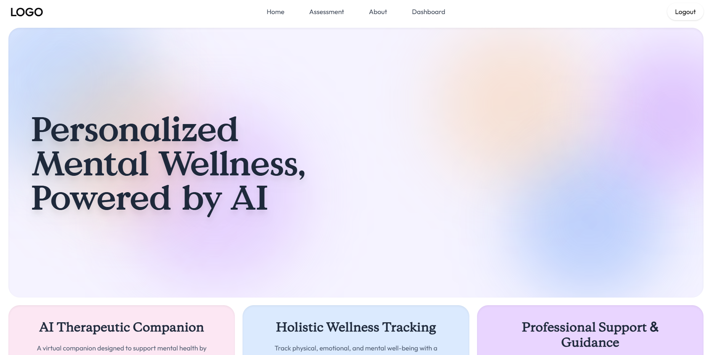
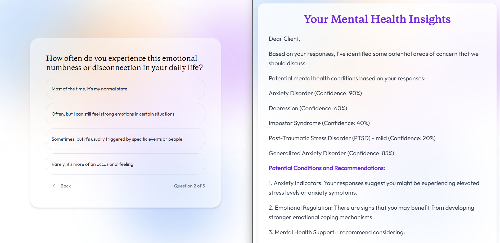
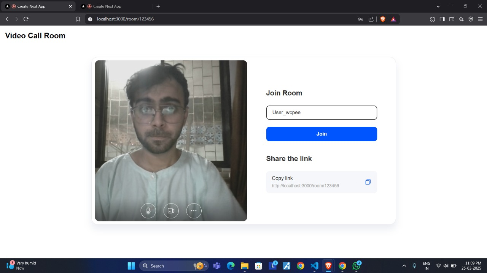
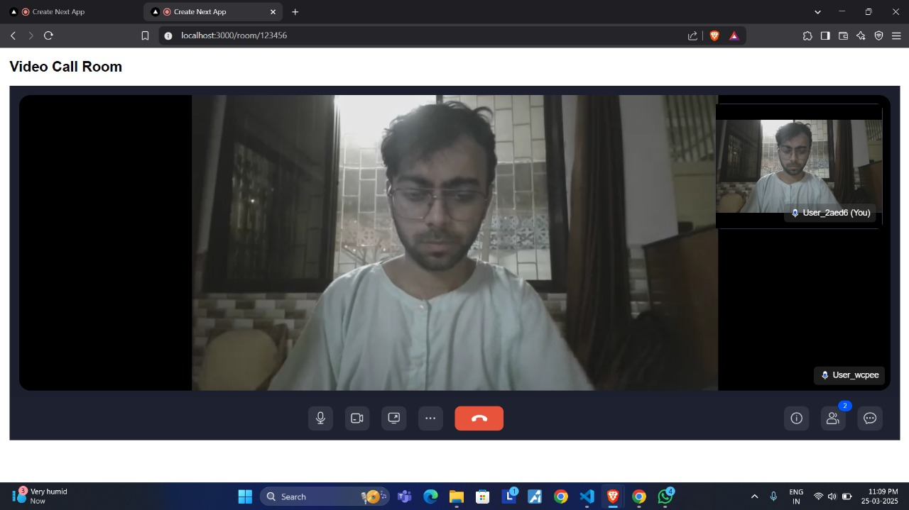
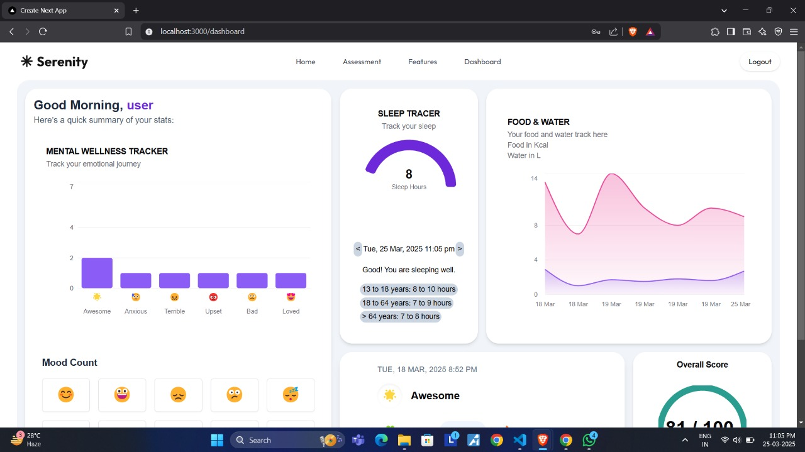
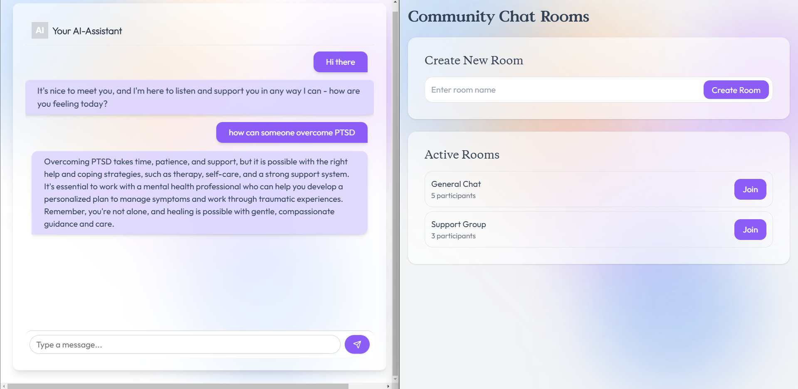
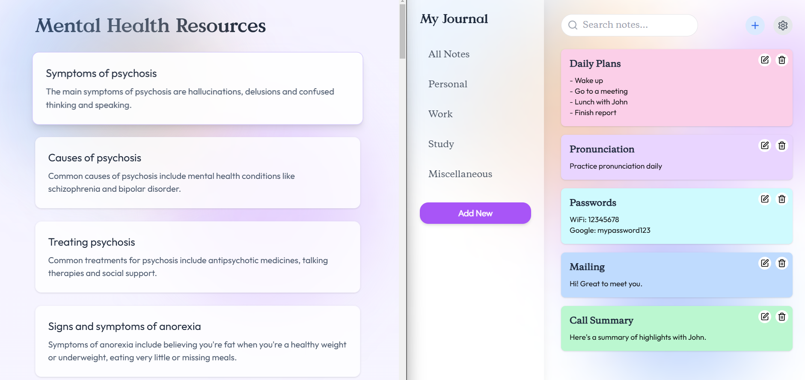
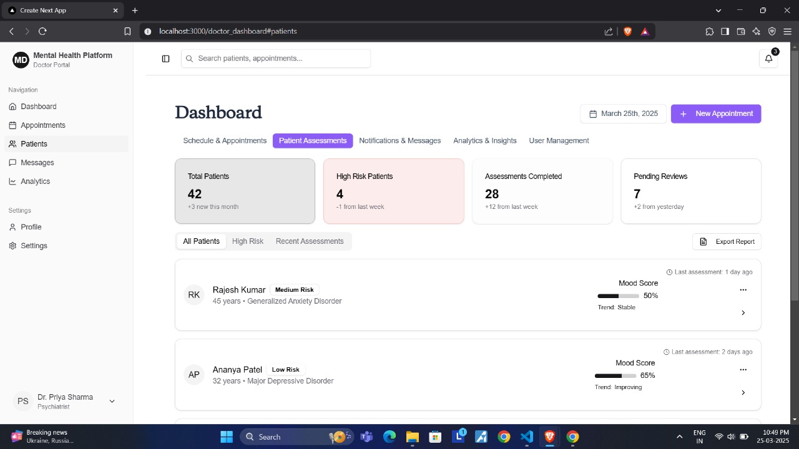
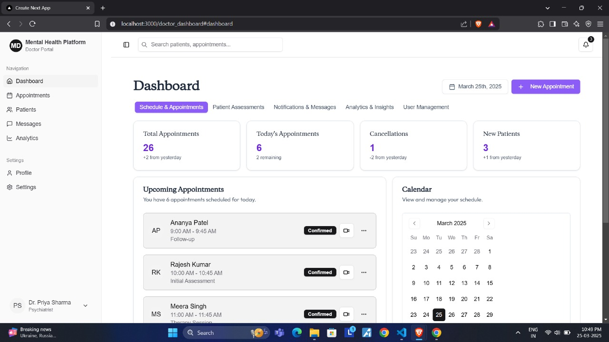

# Serenity - AI Powered Mental Health Assessment & Tracking

Serenity is an innovative mental health platform that combines AI-driven self-assessment with live therapist support and community features. Designed for a hackathon setting, Serenity leverages cutting-edge technology to make mental health care more accessible, personalized, and engaging.

## Overview

Our platform redefines mental health evaluations by moving away from static questionnaires and embracing a fully dynamic, machine learning–powered approach. By analyzing user responses in real time, our ML engine adapts the assessment process, providing nuanced insights and personalized recommendations. This innovation is complemented by an intelligent chatbot, interactive dashboard, secure WebRTC doctor portal, and a thriving community space, creating a holistic ecosystem for mental health support.

### YouTube Link: https://youtu.be/9AKtvtt0qPQ











## Key Features

- **Interactive AI Therapy:**  
  Adaptive MCQ-based questioning for personalized symptom insights.

- **One-on-One Teletherapy:**  
  Real-time video consultations via WebRTC.

- **Community Engagement:**  
  Connect with peers in a supportive environment.

- **Mental Health Journaling:**  
  Secure note-taking for self-reflection and progress tracking.

- **Personalized Dashboards:**  
  Visual health tracking for users and doctors.

- **Curated Health Resources:**  
  Trusted NHS articles and up-to-date mental health info.

<!-- This is a [Next.js](https://nextjs.org) project bootstrapped with [`create-next-app`](https://nextjs.org/docs/app/api-reference/cli/create-next-app). -->

<!-- ## Getting Started -->

<!-- First, run the development server: -->

<!-- ```bash -->
<!-- npm run dev -->
<!-- # or -->
<!-- yarn dev -->
<!-- # or -->
<!-- pnpm dev -->
<!-- # or -->
<!-- bun dev -->
<!-- ``` -->

<!-- Open [http://localhost:3000](http://localhost:3000) with your browser to see the result. -->

<!-- You can start editing the page by modifying `app/page.tsx`. The page auto-updates as you edit the file. -->

<!-- This project uses [`next/font`](https://nextjs.org/docs/app/building-your-application/optimizing/fonts) to automatically optimize and load [Geist](https://vercel.com/font), a new font family for Vercel. -->

<!-- ## Learn More -->

<!-- To learn more about Next.js, take a look at the following resources: -->

<!-- - [Next.js Documentation](https://nextjs.org/docs) - learn about Next.js features and API. -->
<!-- - [Learn Next.js](https://nextjs.org/learn) - an interactive Next.js tutorial. -->

<!-- You can check out [the Next.js GitHub repository](https://github.com/vercel/next.js) - your feedback and contributions are welcome! -->

<!-- ## Deploy on Vercel -->

<!-- The easiest way to deploy your Next.js app is to use the [Vercel Platform](https://vercel.com/new?utm_medium=default-template&filter=next.js&utm_source=create-next-app&utm_campaign=create-next-app-readme) from the creators of Next.js. -->

<!-- Check out our [Next.js deployment documentation](https://nextjs.org/docs/app/building-your-application/deploying) for more details. -->
